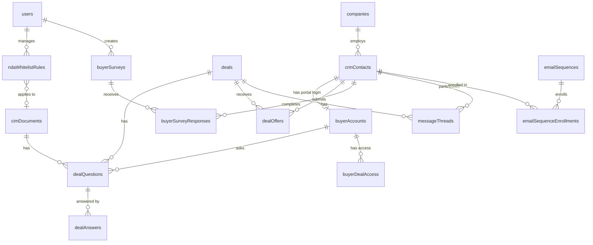

# Comprehensive Buyer Management Hub

## Implementation Progress (Updated 2026-02-23)

| Phase | Status | Notes |
|-------|--------|-------|
| **Phase 1**: NDA Whitelisting | **~85% Complete** | Whitelist CRUD, auto-approve, status page, buyer email all done. Missing: clickwrap NDA, auto-whitelist promotion from survey |
| **Phase 2**: Buyer Profiles & Scoring | **~80% Complete** | CRM buyer fields, company enrichment, survey builder, buyer detail page all done. Missing: automatic score calculation engine |
| **Phase 3**: Communication Hub | **Not Started** | Enhanced message threading, email sequences, communication dashboard |
| **Phase 4**: Buyer Portal & Q&A | **Not Started** | Buyer accounts, portal login, deal Q&A, AI duplicate detection |
| **Phase 5**: LOI/IOI Comparison | **Not Started** | Offer data model, comparison view, buyer portal integration |

### Additional Features Built (Beyond Plan)
- **Seller Management Module**: Full CRM sellers page with seller-specific fields (stage, motivation, timeline, engagement status, asking price, listing status)
- **NDA Hub Dashboard**: Central `/ndas` page with search, filter, batch approve/reject across all documents
- **NDA Detail Page**: Individual NDA view with signature verification details
- **Route Extraction**: Monolithic `routes.ts` split into 13 focused route modules
- **Generic Form System**: Reusable `FormBuilder` + `FormRenderer` components (not buyer-specific)

## Overview

Transform BrokerVault from a CIM creation and sharing tool into a **complete buyer management platform** that replaces HubSpot and email for M&A deal flow. This means every buyer interaction — from first NDA signature through LOI comparison to deal close — happens inside the platform, with full communication history, buyer intelligence, and workflow automation.

The system is built around the premise that **the buyer is the center of gravity**, not the document. A buyer has a profile, a score, a communication history, submitted offers, signed NDAs across multiple deals, and eventually their own portal login.

## Problem Statement / Motivation

Today, M&A brokers using BrokerVault must:
- Manually approve every NDA, even for well-known PE firms and repeat buyers
- Track buyer communications across HubSpot, email, and the platform
- Maintain buyer intelligence (scores, qualifications, history) in spreadsheets or HubSpot
- Compare LOIs/IOIs manually or in a separate app (Deal Compare)
- Have no way for buyers to self-serve (check NDA status, ask questions, view deals)
- Lack a Q&A system where buyers can ask deal questions and get AI-assisted answers

The goal: **one platform for all buyer management**, making HubSpot and email unnecessary.

## Proposed Solution

A phased build across 5 workstreams, prioritized by immediate impact:

| Phase | Workstream | What It Delivers |
|-------|-----------|------------------|
| **1** | NDA Approval & Whitelisting | Auto-approve trusted buyers, domain whitelists, tiered approval |
| **2** | Buyer Profiles & Scoring | Rich buyer profiles, qualification scores, organization tracking, website enrichment |
| **3** | Communication Hub | All buyer comms in-platform, email integration, thread-per-deal, replace HubSpot |
| **4** | Buyer Portal & Q&A | Buyer-facing login, deal Q&A with AI duplicate detection, self-serve access |
| **5** | LOI/IOI Comparison | Import from Deal Compare, side-by-side offer comparison per deal |

---

## Phase 1: NDA Approval & Whitelisting

### Problem
Every NDA requires manual broker approval, even for repeat buyers or well-known PE firms. This creates delays and unnecessary work.

### Solution

#### 1a. Whitelist System

**New schema: `ndaWhitelistRules`**

| Field | Type | Description |
|-------|------|-------------|
| `id` | serial | PK |
| `userId` | integer FK | Broker who owns the rule |
| `organizationId` | integer FK | Org-level rules (nullable for personal) |
| `ruleType` | enum | `domain`, `email`, `organization` |
| `ruleValue` | text | e.g., `blackstone.com`, `john@buyer.com`, or company ID |
| `appliesToAllDeals` | boolean | Global vs. per-deal whitelist |
| `cimDocumentId` | integer FK | Specific deal (nullable if global) |
| `isActive` | boolean | Enable/disable without deleting |
| `createdAt` | timestamp | |
| `notes` | text | Why this rule exists |

**Whitelist rule types:**
- **Domain-based**: Auto-approve any signer with email `@blackstone.com`, `@kkr.com`, etc.
- **Email-based**: Auto-approve specific email addresses
- **Organization-based**: Auto-approve any contact belonging to a whitelisted company record in the CRM

**Implementation files to modify:**
- `shared/schema.ts` — Add `ndaWhitelistRules` table
- `server/routes.ts` — Modify NDA signing endpoint (`POST /api/share/:shareSlug/sign-nda`) to check whitelist before creating pending signature
- `server/storage.ts` — Add whitelist CRUD methods
- New API endpoints: `GET/POST/PATCH/DELETE /api/nda-whitelist`

#### 1b. Auto-Approve vs Manual Approval

The NDA signing flow becomes three paths:

```
Path A — Auto-Approve (whitelisted buyer):
  1. Buyer signs NDA
  2. System checks whitelist → match found
  3. NDA auto-approved → access token created immediately
  4. Buyer receives email:
     - "Your NDA has been approved. Click here to view the CIM."
     - Broker contact info included
  5. Broker receives info notification (no action needed)
  6. Logged in ndaAuditLog with whitelistRuleId

Path B — Manual Approval Required (not whitelisted):
  1. Buyer signs NDA
  2. System checks whitelist → no match
  3. NDA signature created (approved=false)
  4. Buyer receives "NDA Received" email:
     ┌─────────────────────────────────────────────────────┐
     │  Your NDA Has Been Received                        │
     │                                                     │
     │  Thank you, {buyerName}. Your NDA for              │
     │  {cimTitle} has been received and is under review.  │
     │  You'll hear back within 24 hours.                 │
     │                                                     │
     │  [Check Your Status]  ← links to status page       │
     │                                                     │
     │  While you wait, complete your buyer profile        │
     │  to expedite this and future reviews:              │
     │                                                     │
     │  [Complete Buyer Profile]  ← links to survey form   │
     │                                                     │
     │  Completing your profile helps us match you with    │
     │  relevant opportunities and can qualify you for     │
     │  instant access on future deals.                   │
     │                                                     │
     │  {broker contact info}                             │
     └─────────────────────────────────────────────────────┘
  5. Broker receives approval request (existing sendOwnerApprovalNotification)
  6. Broker approves → buyer gets approval email with CIM link (existing sendApprovalEmail)

Path C — Manual Approval, but buyer completes survey:
  1-5. Same as Path B
  6. Buyer clicks "Complete Buyer Profile" → lands on survey page
  7. Survey responses populate crmContacts buyer fields
  8. System evaluates: does buyer now qualify for auto-whitelist?
     - e.g., PE firm domain, proof of funds uploaded, high score
     - If yes → add whitelist rule for this buyer's email/domain
     - Broker notified: "Buyer {name} qualified for auto-approval"
  9. For THIS deal: still requires manual approval (already pending)
  10. For FUTURE deals: buyer is whitelisted → Path A
```

**Current gap being fixed:** When `ndaApprovalRequired = true`, the current code (`server/routes.ts:9717-9739`) sends NO email to the buyer — only an on-screen message. Path B adds a proper buyer-facing email with status tracking and profile completion.

**Key code changes in `server/routes.ts` (line ~9717):**

```typescript
if (cimDoc.ndaApprovalRequired) {
  // CHECK WHITELIST FIRST
  const whitelistMatch = await checkWhitelist(signerEmail, cimDoc.id, cimDoc.userId);

  if (whitelistMatch) {
    // PATH A: Auto-approve
    await storage.approveNdaSignature(signature.id, cimDoc.userId);
    await sendApprovalEmail(signature, cimDoc, ownerProfileData);
    await sendAutoApprovalNotificationEmail(owner.email, signerName, signerEmail, cimDoc.title);
    // Log auto-approval
    await storage.createNdaAuditLog({
      signingSessionId: null,
      action: 'auto_approved',
      details: { whitelistRuleId: whitelistMatch.id, ruleType: whitelistMatch.ruleType }
    });
    res.json({ success: true, signature, autoApproved: true });
  } else {
    // PATH B: Manual approval — send buyer "NDA Received" email
    await sendNdaReceivedEmail(signerEmail, signerName, cimDoc, ownerProfileData, statusPageUrl, surveyUrl);
    await sendOwnerApprovalNotification(owner.email, ...);
    res.json({ success: true, signature, requiresApproval: true });
  }
} else {
  // No approval required — existing flow (sendNdaSignedEmail)
}
```

#### 1c. NDA Status Page

**New public page: `/nda/status/:signatureId`** (or token-based URL)

Buyers can check their NDA approval status without logging in. Accessed via the link in the "NDA Received" email.

Shows:
- NDA signed date
- Current status: "Under Review" / "Approved" / "Declined"
- If approved: link to CIM
- If pending: "Complete your buyer profile to expedite review" CTA
- Broker contact information

**Implementation:** Lightweight public endpoint. Uses `ndaSignatures.id` + a short token for security (not guessable). No auth required.

#### 1d. Whitelist Management UI

**New section in document NDA settings (existing NDA protection panel):**
- Toggle: "Enable auto-approval for whitelisted buyers"
- Table showing active whitelist rules for this document
- "Add Rule" dialog: domain, email, or organization picker
- Global whitelist management page at `/settings/nda-whitelist`
- Ability to apply global whitelist to individual documents

#### 1e. Clickwrap NDA Option

Add a lighter-weight NDA option alongside the existing PDF e-signature flow:
- Toggle on CIM: "Use clickwrap NDA" vs "Use custom NDA template"
- Clickwrap shows NDA terms inline, buyer checks "I agree" + types name
- Faster for standard deals; still creates `ndaSignatures` record with audit trail
- Can be combined with whitelisting (clickwrap + auto-approve = instant access)

### Acceptance Criteria — Phase 1

- [x] Broker can create domain-based whitelist rules (global and per-document)
  - `nda-whitelist-routes.ts` CRUD endpoints + `nda-whitelist-page.tsx` settings UI
- [x] Broker can create email-based whitelist rules
  - Same endpoints, `ruleType: "email"`
- [x] Broker can create organization-based whitelist rules (linked to CRM companies)
  - Same endpoints, `ruleType: "organization"` checks CRM contact's companyId
- [x] Whitelisted buyers auto-approved on NDA signing → immediate CIM access
  - `nda-signing-routes.ts:1192-1203` calls `checkWhitelist()` before requiring manual approval
  - On match: auto-approves, advances buyer pipeline, sends access email
- [x] Broker receives info notification when auto-approval occurs
  - Owner notification sent via existing `sendOwnerApprovalNotification`
- [x] Non-whitelisted buyers receive "NDA Received" email with status link and survey link
  - `sendNdaPendingEmail()` in `email.ts:2006-2062` with Check Status + Complete Profile CTAs
- [x] NDA status page shows buyer their current approval status (public, token-secured)
  - `nda-status-page.tsx` with auto-refresh while pending, CIM link when approved
- [x] Survey/profile form accessible from NDA email (populates buyer fields on crmContacts)
  - `buyer-form-page.tsx` public form → `buyer-survey-routes.ts` POST → CRM update
- [ ] Survey completion can qualify buyer for auto-whitelist on future deals
  - NOT YET IMPLEMENTED: Auto-whitelist promotion logic after survey completion
- [x] Whitelist management UI on document settings page and global settings
  - Global: `/settings/nda-whitelist` page
  - Per-contact/company: toggle-whitelist endpoints in `nda-whitelist-routes.ts`
- [ ] Clickwrap NDA option available as alternative to PDF e-signature
  - NOT YET IMPLEMENTED: Clickwrap toggle and inline NDA terms display
- [x] All auto-approvals logged in `ndaAuditLog` for compliance
  - Existing audit log used on approval
- [x] Existing NDA approval flow unchanged for non-whitelisted buyers who skip survey
  - Whitelist check is additive; falls through to manual approval if no match

---

## Phase 2: Buyer Profiles & Scoring

### Problem
Buyer information is scattered: NDA signatures have name/email, CRM contacts have basic info, deal buyers track pipeline stage, but there's no unified "buyer profile" that shows everything about a buyer across all deals.

### Solution

#### 2a. Enhanced Buyer Profile (on crmContacts)

`crmContacts` with `contactType = 'buyer'` becomes the **canonical buyer record**. Rather than creating a separate `buyerProfiles` table (which would require joins on every buyer query), add M&A-specific columns directly to `crmContacts`. The table already has `contactType`, `lifecycleStage`, `leadStatus`, `customProperties`, `companyId`, `linkedinUrl`, and `source` — so we only add what's genuinely new.

**New columns on `crmContacts`** (only populated when `contactType = 'buyer'`):

| Field | Type | Description |
|-------|------|-------------|
| `buyerType` | enum | `strategic`, `financial`, `individual`, `search_fund`, `family_office`, `other` |
| `acquisitionCriteria` | jsonb | Revenue range, EBITDA range, industries, geographies |
| `financialCapability` | enum | `unverified`, `self_reported`, `proof_of_funds`, `pre_approved` |
| `proofOfFundsFile` | text | File path to uploaded proof |
| `proofOfFundsVerifiedAt` | timestamp | When broker verified |
| `estimatedBudget` | text | Acquisition budget range |
| `priorAcquisitions` | integer | Number of prior deals |
| `qualificationScore` | integer | Computed score (1-100) |
| `qualificationDetails` | jsonb | Breakdown of scoring components |
| `lastScoredAt` | timestamp | When score was last computed |
| `isActiveBuyer` | boolean | Currently looking to acquire |

Fields already on `crmContacts` that are reused as-is: `linkedinUrl`, `source`, `notes` (used for broker notes), `avatarUrl`, `customProperties` (for any additional buyer-specific data).

#### 2b. Buyer Scoring System

**Scoring model (configurable weights per broker):**

| Criterion | Default Weight | Auto-Calculated? |
|-----------|---------------|-----------------|
| Financial Capability | 25% | Partially (proof of funds uploaded = higher score) |
| Engagement Level | 20% | Yes (CIM views, questions asked, response time) |
| NDA History | 15% | Yes (NDAs signed, approval rate across deals) |
| Strategic Fit | 15% | Manual (broker rates fit per deal) |
| Prior Acquisitions | 10% | Manual (from buyer profile) |
| Responsiveness | 10% | Yes (avg response time to broker messages) |
| Completeness | 5% | Yes (profile completeness percentage) |

**Auto-calculated signals from existing data:**
- `documentViews` — How many times they viewed the CIM (from `documentViews` table)
- `documentDownloads` — Did they download the CIM? (from `documentDownloads` table)
- NDA signing speed — Time from share link to NDA completion
- Message response time — Average time to respond in message threads
- Profile completeness — How much of the buyer profile is filled out
- Number of deals they're involved in across the broker's pipeline

The score is stored directly on `crmContacts.qualificationScore` with the breakdown in `qualificationDetails` JSONB. Score history tracking can be added later if needed — the current score is sufficient for implementation.

#### 2c. Organization / Company Enrichment

When a buyer signs an NDA or is added to the CRM, auto-enrich their company:

**Website scraping on buyer URL submission:**
- When a buyer provides their website URL (via NDA form, contact form, or profile)
- Queue a background job to fetch the website
- Extract: company description, industry, employee count (from About/Team pages)
- Store in `companies` record linked to the contact
- Use Perplexity API (already integrated) for deeper company research

**New fields on `companies` table:**

| Field | Type | Description |
|-------|------|-------------|
| `enrichmentStatus` | enum | `pending`, `enriched`, `failed`, `manual` |
| `enrichedAt` | timestamp | |
| `enrichmentData` | jsonb | Raw enrichment results |
| `employeeCount` | text | |
| `foundedYear` | integer | |
| `companyType` | enum | `pe_firm`, `strategic_acquirer`, `search_fund`, `family_office`, `individual`, `other` |

#### 2d. Buyer Survey

When NDA approval is required (or optionally even without), present buyers with a qualification survey before or after NDA signing.

**New schema: `buyerSurveys`**

| Field | Type | Description |
|-------|------|-------------|
| `id` | serial | PK |
| `userId` | integer FK | Broker who created the survey |
| `cimDocumentId` | integer FK | Deal-specific (nullable for default) |
| `name` | text | Survey name |
| `questions` | jsonb | Array of question objects |
| `isDefault` | boolean | Use as default for all deals |
| `isRequired` | boolean | Must complete to access CIM |
| `createdAt` | timestamp | |

**Survey question schema (jsonb):**
```json
{
  "id": "uuid",
  "text": "What is your acquisition budget?",
  "type": "select|text|number|file_upload|multi_select",
  "options": ["< $1M", "$1M - $5M", "$5M - $10M", "$10M+"],
  "required": true,
  "category": "financial_capability"
}
```

**New schema: `buyerSurveyResponses`**

| Field | Type | Description |
|-------|------|-------------|
| `id` | serial | PK |
| `surveyId` | integer FK | |
| `contactId` | integer FK | Links to `crmContacts` (nullable for pre-contact submissions) |
| `cimDocumentId` | integer FK | |
| `signerEmail` | text | For submissions before CRM contact exists |
| `responses` | jsonb | Question-answer pairs |
| `completedAt` | timestamp | |

**Integration with NDA flow:**
- After NDA signing (or during, as additional fields)
- Survey responses auto-populate buyer profile fields
- Survey responses feed into buyer score calculation
- Broker can view survey responses alongside NDA signature

#### 2e. Buyer Profile UI

**Enhanced existing page: `/contacts/:id`**

When viewing a contact with `contactType = 'buyer'`, the existing contact detail page shows an enhanced buyer view:

- **Header**: Name, company, buyer type badge, qualification score (color-coded gauge)
- **Tab: Overview**: Bio, acquisition criteria, financial capability, source
- **Tab: Deal Activity**: All deals this buyer is involved in, with stage per deal
- **Tab: NDAs**: All NDAs signed across all deals, with status (approved/pending/rejected)
- **Tab: Communications**: Full message history across all deals (threads linked to this buyer's email)
- **Tab: Documents**: CIMs they have access to, view/download analytics
- **Tab: Offers**: LOIs/IOIs submitted (Phase 5)
- **Tab: Survey Responses**: All survey responses
- **Tab: Timeline**: Chronological activity feed (NDA signed, CIM viewed, message sent, stage changed)

**Sidebar widget on Deal Detail page:**
- When viewing a deal's buyer pipeline, clicking a buyer shows a mini-profile card
- Score badge, key stats, quick link to full profile

### Acceptance Criteria — Phase 2

- [x] CRM contact auto-created/updated with `contactType = 'buyer'` when NDA is signed
  - `nda-signing-routes.ts:1038-1078` finds or creates CRM contact on NDA sign
  - Auto-links to deal via `dealBuyers` with "NDA Signed" stage
- [x] Buyer type classification (strategic, financial, search fund, etc.) on contact record
  - `buyerType` enum field on `crmContacts` schema, editable on buyer detail page
- [x] Qualification score calculated from auto + manual signals, stored on `crmContacts`
  - `qualificationScore` (1-100) and `qualificationDetails` JSONB on `crmContacts`
  - Buyer detail page allows editing; score badge displayed
  - NOTE: Automatic score calculation engine NOT yet built — currently manual entry
- [x] Score displayed on buyer pipeline, contact detail, and deal detail pages
  - `buyer-detail-page.tsx` shows score prominently
  - `buyer-pipeline.tsx` and contacts pages show score badges
- [x] Company enrichment triggered on new buyer (website scraping + Perplexity)
  - `company-enrichment.ts` service auto-creates companies from email domains
  - `nda-signing-routes.ts:1082-1086` queues background enrichment
- [x] Buyer survey builder with configurable questions per deal
  - `/settings/buyer-surveys` page with `FormBuilder` component
  - Supports deal-specific and default surveys
- [x] Survey presented during/after NDA signing flow
  - Link included in pending NDA email and on NDA status page
- [x] Survey responses stored and visible on contact detail page
  - Stored in `buyerSurveyResponses`, linked to CRM contact
  - Responses mapped to CRM fields on submission
- [x] Contact detail page (for buyers) shows cross-deal history (NDAs, comms, offers, views)
  - `buyer-detail-page.tsx` with buyer-specific fields, company linking, timeline
- [x] Existing `crmContacts` and `dealBuyers` data flows seamlessly into enhanced buyer view
  - Buyers page filters `contactType='buyer'`, uses existing CRM endpoints

---

## Phase 3: Communication Hub (HubSpot Replacement)

### Problem
Buyer communications happen across email, HubSpot, and the platform's basic messaging. Brokers can't see a unified communication timeline per buyer or per deal, and buyers have no way to communicate without email.

### Solution

#### 3a. Enhanced Message Threading

Extend the existing `messageThreads`/`messages` system to be deal-aware and buyer-aware.

**Modifications to `messageThreads`:**

| New Field | Type | Description |
|-----------|------|-------------|
| `dealId` | integer FK | Thread linked to specific deal |
| `contactId` | integer FK | Thread linked to buyer's CRM contact record |
| `threadType` | enum | `inquiry`, `nda_followup`, `deal_qa`, `general`, `offer_discussion` |
| `priority` | enum | `normal`, `high`, `urgent` |
| `assignedTo` | integer FK | Team member assigned to respond |

**Modifications to `messages`:**

| New Field | Type | Description |
|-----------|------|-------------|
| `dealId` | integer FK | Context for the message |
| `isInternal` | boolean | Internal broker team note (not visible to buyer) |

#### 3b. Unified Communication Timeline

**Per-buyer view**: All messages, emails, activities with this buyer across all deals
- Pulls from: `messageThreads`, `crmActivities`, `emailSyncLog`
- Chronological feed with filters: all, messages, emails, activities

**Per-deal view**: All buyer communications for a specific deal
- Shows threads grouped by buyer
- Internal notes visible only to team
- Unread indicators and assignment

#### 3c. In-Platform Email Sending

Extend the existing `sendEmailWithOAuth` to allow brokers to compose and send emails from within the platform:

- Compose email dialog in deal detail and buyer profile pages
- Send from broker's connected Gmail/Microsoft account
- Email automatically logged as `crmActivity` (type: 'email')
- Reply tracking via SendGrid inbound webhook
- Thread continuity — replies are matched to existing threads

**Email sequence automation (replaces HubSpot sequences):**

**New schema: `emailSequences`**

| Field | Type | Description |
|-------|------|-------------|
| `id` | serial | PK |
| `organizationId` | integer FK | |
| `name` | text | Sequence name |
| `steps` | jsonb | Array of step definitions |
| `isActive` | boolean | |
| `createdAt` | timestamp | |

**Step definition:**
```json
{
  "stepNumber": 1,
  "type": "email",
  "delayDays": 0,
  "templateId": 123,
  "subject": "Following up on {{deal.name}}",
  "body": "Hi {{buyer.firstName}}, ..."
}
```

**New schema: `emailSequenceEnrollments`**

| Field | Type | Description |
|-------|------|-------------|
| `id` | serial | PK |
| `sequenceId` | integer FK | |
| `contactId` | integer FK | Links to `crmContacts` |
| `dealId` | integer FK | |
| `currentStep` | integer | |
| `status` | enum | `active`, `paused`, `completed`, `replied`, `bounced` |
| `enrolledAt` | timestamp | |
| `nextSendAt` | timestamp | |

**Auto-pause rules:**
- Buyer replies → pause sequence, notify broker
- Buyer signs NDA → pause/complete sequence
- Email bounces → pause and flag

#### 3d. Communication Dashboard

**New page: `/communications`** (replaces basic messages page)

- **Inbox view**: All threads needing attention, sortable by deal, buyer, priority, date
- **Per-deal view**: Communication threads grouped by deal
- **Unread badge** in sidebar navigation
- **Quick reply** without leaving the inbox
- **Assignment**: Assign threads to team members
- **Internal notes**: Team members can add internal notes to any thread
- **Search**: Full-text search across all communications

### Acceptance Criteria — Phase 3

- [ ] Message threads linked to deals and buyer profiles
- [ ] Unified communication timeline per buyer (cross-deal)
- [ ] Unified communication timeline per deal (all buyers)
- [ ] In-platform email composition sending from connected accounts
- [ ] Emails sent from platform logged as CRM activities
- [ ] Email replies matched to threads via SendGrid inbound
- [ ] Email sequence builder with templates and delays
- [ ] Sequence auto-pause on buyer reply or NDA sign
- [ ] Communication dashboard with inbox, assignment, and search
- [ ] Internal notes on threads (not visible to buyers)
- [ ] Unread indicators in navigation

---

## Phase 4: Buyer Portal & Q&A

### Problem
Buyers have no way to self-serve. They can't check their NDA status, view deals they have access to, or ask questions without email. Brokers spend time answering the same questions across buyers.

### Solution

#### 4a. Buyer Portal (Lightweight Login)

**Access model (hybrid):**
1. **Share links remain the entry point** — buyer receives link, signs NDA
2. **After NDA signing**, buyer is invited to create a lightweight account
3. **Portal login**: email + magic link (no password required) or optional password
4. **Session**: standard express-session, separate from broker auth

**New schema: `buyerAccounts`**

| Field | Type | Description |
|-------|------|-------------|
| `id` | serial | PK |
| `email` | text | Unique |
| `firstName` | text | |
| `lastName` | text | |
| `phone` | text | |
| `companyName` | text | |
| `password` | text | Optional (nullable), bcrypt hashed |
| `contactId` | integer FK | Links directly to `crmContacts` (single FK, no intermediary) |
| `isActive` | boolean | |
| `lastLoginAt` | timestamp | |
| `magicLinkToken` | text | Current active magic link token |
| `magicLinkExpiresAt` | timestamp | Token expiry |
| `createdAt` | timestamp | |

**New schema: `buyerDealAccess`**

| Field | Type | Description |
|-------|------|-------------|
| `id` | serial | PK |
| `buyerAccountId` | integer FK | |
| `cimDocumentId` | integer FK | |
| `dealId` | integer FK | |
| `ndaSignatureId` | integer FK | |
| `accessLevel` | enum | `pending_nda`, `pending_approval`, `approved`, `revoked` |
| `grantedAt` | timestamp | |

**Buyer portal pages:**
- `/buyer/login` — Magic link or password login
- `/buyer/dashboard` — List of deals with access, NDA status per deal
- `/buyer/deal/:id` — CIM view, Q&A, document downloads
- `/buyer/profile` — Edit profile, upload proof of funds
- `/buyer/messages` — Communication threads with brokers
- `/buyer/offers` — Submitted LOIs/IOIs (Phase 5)

**Portal features:**
- See all deals they have access to (or pending NDA approval)
- View CIM content for approved deals
- Submit questions via Q&A (see 4b)
- Communicate with broker via in-platform messaging
- Track NDA status (signed, pending approval, approved)
- Upload documents (proof of funds, LOIs)

#### 4b. Deal Q&A System

**New schema: `dealQuestions`**

| Field | Type | Description |
|-------|------|-------------|
| `id` | serial | PK |
| `dealId` | integer FK | |
| `cimDocumentId` | integer FK | |
| `buyerAccountId` | integer FK | Who asked (nullable for anonymous) |
| `buyerEmail` | text | Fallback identifier |
| `category` | text | `financial`, `operations`, `legal`, `employees`, `real_estate`, `customers`, `general` |
| `questionText` | text | The question |
| `status` | enum | `submitted`, `under_review`, `answered`, `closed`, `duplicate` |
| `priority` | enum | `low`, `normal`, `high` |
| `assignedTo` | integer FK | Team member assigned |
| `duplicateOfId` | integer FK | Points to original if duplicate |
| `isPublic` | boolean | Visible to all buyers on this deal (default: false) |
| `createdAt` | timestamp | |
| `updatedAt` | timestamp | |

**New schema: `dealAnswers`**

| Field | Type | Description |
|-------|------|-------------|
| `id` | serial | PK |
| `questionId` | integer FK | |
| `answeredBy` | integer FK | Broker/team member |
| `answerText` | text | |
| `isApproved` | boolean | For multi-person approval workflow |
| `approvedBy` | integer FK | |
| `approvedAt` | timestamp | |
| `createdAt` | timestamp | |
| `updatedAt` | timestamp | |

**AI duplicate detection:**
- When buyer submits a question, use OpenAI embeddings (already integrated) to find similar questions
- Show buyer: "These similar questions have already been answered" before submission
- Show broker: "This may be a duplicate of Q#42" flag on new questions
- Uses vector similarity on question text + category matching
- Embeddings stored in `dealQuestions` table (new `embedding` vector column, or use a separate table)

**Q&A workflow:**
```
Buyer submits question
  → AI checks for duplicates → show similar Q&A to buyer
  → If new: create question (status: submitted)
  → Auto-categorize via AI
  → Route to assigned team member (if category routing configured)
  → Broker/team drafts answer
  → Answer published → buyer notified
  → (Optional: approval workflow if multiple team members — off by default)
  → If isPublic=true: answer visible to all buyers on this deal
```

**Q&A UI (broker side):**
- New tab on Deal Detail page: "Q&A"
- Table of questions with status, category, assignee, buyer
- Answer composer with rich text
- Bulk actions: assign, categorize, mark as duplicate
- Public Q&A toggle per answer

**Q&A UI (buyer portal):**
- Ask a question form with category selector
- "Similar questions" panel (AI-powered)
- View their submitted questions and answers
- View public Q&A for the deal

### Acceptance Criteria — Phase 4

- [ ] Buyer accounts created via magic link invitation after NDA signing
- [ ] Buyer portal login (magic link + optional password)
- [ ] Buyer dashboard showing all deals with access level
- [ ] Buyer can view approved CIMs from their portal
- [ ] Buyer can communicate with broker from portal
- [ ] Q&A system on deal detail page (broker side)
- [ ] Q&A submission from buyer portal and share page
- [ ] AI duplicate question detection using embeddings
- [ ] Auto-categorization of questions
- [ ] Category-based routing to team members
- [ ] Optional answer approval workflow (off by default, enable for teams)
- [ ] Public Q&A toggle (visible to all deal buyers)
- [ ] Buyer profile editing from portal (including proof of funds upload)

---

## Phase 5: LOI/IOI Comparison (Future — Integrate Deal Compare)

### Problem
Brokers compare offers in spreadsheets or a separate app (Deal Compare). LOI/IOI data isn't connected to the buyer profile or deal pipeline.

### Solution

#### 5a. Offer Data Model

**New schema: `dealOffers`**

| Field | Type | Description |
|-------|------|-------------|
| `id` | serial | PK |
| `dealId` | integer FK | |
| `contactId` | integer FK | Links to `crmContacts` (the buyer) |
| `buyerAccountId` | integer FK | nullable (if submitted via portal) |
| `offerType` | enum | `ioi`, `loi` |
| `status` | enum | `received`, `under_review`, `countered`, `accepted`, `declined`, `expired`, `withdrawn` |
| **Valuation** | | |
| `valuationLow` | numeric | Low end of range (IOI) or specific price (LOI) |
| `valuationHigh` | numeric | High end of range (IOI) |
| `ebitdaMultipleLow` | numeric | EBITDA multiple range low |
| `ebitdaMultipleHigh` | numeric | EBITDA multiple range high |
| **Structure** | | |
| `transactionType` | enum | `asset_purchase`, `stock_purchase`, `merger` |
| `cashPercentage` | numeric | % cash at close |
| `sellerNotePercentage` | numeric | % seller financing |
| `earnoutPercentage` | numeric | % earnout |
| `equityRolloverPercentage` | numeric | % equity rollover |
| **Terms** | | |
| `earnoutTerms` | jsonb | Metric, period, cap, payment schedule |
| `escrowPercentage` | numeric | Holdback % |
| `escrowDurationMonths` | integer | |
| `dueDiligenceDays` | integer | |
| `exclusivityDays` | integer | No-shop period (LOI) |
| `nonCompeteYears` | integer | |
| `nonCompeteGeography` | text | |
| `workingCapitalTarget` | numeric | |
| `closingConditions` | jsonb | Array of condition strings |
| **Dates** | | |
| `submittedAt` | timestamp | |
| `expiresAt` | timestamp | |
| `respondedAt` | timestamp | |
| **Documents** | | |
| `documentPath` | text | Uploaded LOI/IOI PDF |
| `notes` | text | Broker notes |
| `customFields` | jsonb | Extensible fields |
| `createdAt` | timestamp | |
| `updatedAt` | timestamp | |

#### 5b. Comparison View

- Side-by-side comparison of all offers for a deal
- Color-coded scoring: green (favorable), yellow (neutral), red (concern)
- Sortable by any field
- Export to PDF for seller presentation
- Import from Deal Compare (CSV/JSON format TBD when repo is shared)

#### 5c. Buyer Portal Integration

- Buyers can submit LOI/IOI from their portal (structured form)
- Status tracking: submitted → under review → countered/accepted/declined
- Broker can request revisions or counter

### Acceptance Criteria — Phase 5

- [ ] LOI and IOI data model with all standard M&A fields
- [ ] Offer submission from buyer portal (structured form)
- [ ] Side-by-side comparison view on deal detail page
- [ ] Color-coded scoring on comparison fields
- [ ] Offer status workflow (received → reviewed → countered/accepted/declined)
- [ ] PDF export of comparison for seller presentation
- [ ] Import path from Deal Compare app (future integration)
- [ ] Offer history linked to buyer profile

---

## Technical Approach

### Architecture

This builds on the existing architecture (React + Express + Drizzle + PostgreSQL). No new frameworks or services needed.

**Key architectural decisions:**

1. **Buyer accounts are separate from user accounts** — The `users` table is for brokers. Buyers get `buyerAccounts` with a separate auth flow (magic link + optional password). This keeps the permission model clean and avoids subscription complexity.

2. **Buyer data lives on crmContacts, not a separate table** — M&A-specific fields (`buyerType`, `qualificationScore`, `financialCapability`, etc.) are added as columns on `crmContacts`. This avoids a join on every buyer query and leverages the existing `contactType = 'buyer'` discriminator. `buyerAccounts` references `contactId` directly — one hop, not two.

3. **Communications built on existing messaging** — The `messageThreads`/`messages` tables are enhanced (not replaced) with deal/buyer linkage. SendGrid inbound email handling already works.

4. **AI features use existing OpenAI integration** — Q&A duplicate detection and auto-categorization use the OpenAI SDK already in the project. Embeddings stored as JSONB (or pgvector if added later).

5. **Whitelisting is rule-based** — Simple rules evaluated at NDA signing time. No complex workflow engine needed.

6. **Email sequences are new, not extending onboardingEmailSequences** — The existing `onboardingEmailSequences` table is for platform marketing to users. The new `emailSequences` table is for broker-to-buyer deal communication — different purpose, different audience, different data model.

### Database Changes (ERD)



### Implementation Phases

#### Phase 1: NDA Approval & Whitelisting (estimated scope: ~15 files)

**New files:**
- `shared/schema.ts` — Add `ndaWhitelistRules` table + Zod validators
- `server/routes/nda-whitelist-routes.ts` — CRUD API endpoints
- `client/src/pages/settings/nda-whitelist-settings.tsx` — Global whitelist management
- `client/src/components/nda-whitelist-panel.tsx` — Per-document whitelist UI

**Modified files:**
- `server/routes.ts` — Modify NDA signing endpoint (line ~9717) to check whitelist + send new buyer email
- `server/storage.ts` — Add whitelist storage methods
- `server/email.ts` — Add `sendNdaReceivedEmail` (with status + survey links) and `sendAutoApprovalNotificationEmail`
- `client/src/pages/documents-page.tsx` — Add whitelist toggle to NDA settings
- `client/src/pages/share-page.tsx` — Clickwrap NDA option

**New pages:**
- `client/src/pages/nda-status-page.tsx` — Public NDA status check page
- `client/src/pages/buyer-survey-page.tsx` — Public buyer profile/survey form (pre-auth, token-secured)

#### Phase 2: Buyer Profiles & Scoring (~15 files)

**New files:**
- `server/services/buyer-scoring.ts` — Score calculation engine
- `server/services/company-enrichment.ts` — Website scraping + Perplexity enrichment
- `server/routes/buyer-routes.ts` — Buyer-specific API (surveys, scoring)
- `client/src/components/crm/buyer-score-badge.tsx` — Score display component
- `client/src/components/crm/buyer-survey-builder.tsx` — Survey configuration
- `client/src/components/crm/buyer-survey-form.tsx` — Survey completion form

**Modified files:**
- `shared/schema.ts` — Add buyer columns to `crmContacts`, add `buyerSurveys`, `buyerSurveyResponses`
- `server/routes.ts` — Link NDA signing to buyer profile population
- `server/routes/crm-routes.ts` — Enhance contact endpoints for buyer-specific data
- `client/src/pages/crm/contact-detail-page.tsx` — Enhanced view when `contactType = 'buyer'`
- `client/src/pages/crm/deal-detail-page.tsx` — Show buyer scores in pipeline
- `client/src/components/crm/buyer-pipeline.tsx` — Score badges on buyer cards

#### Phase 3: Communication Hub (~15 files)

**New files:**
- `server/routes/email-sequence-routes.ts` — Sequence CRUD + enrollment
- `server/services/email-sequence-processor.ts` — Sequence execution engine
- `client/src/pages/communications-page.tsx` — Communication dashboard
- `client/src/components/email-composer.tsx` — In-platform email composition
- `client/src/components/email-sequence-builder.tsx` — Sequence builder UI

**Modified files:**
- `shared/schema.ts` — Add `emailSequences`, `emailSequenceEnrollments`, enhance `messageThreads`
- `server/message-service.ts` — Add deal/buyer linkage
- `server/routes/messages.ts` — Enhanced thread queries
- `client/src/pages/crm/deal-detail-page.tsx` — Communications tab
- `client/src/components/enhanced-message-center.tsx` — Enhanced with deal/buyer context

#### Phase 4: Buyer Portal & Q&A (~20 files)

**New files:**
- `server/buyer-auth.ts` — Buyer authentication (magic link + password)
- `server/routes/buyer-portal-routes.ts` — All buyer-facing API endpoints
- `server/services/qa-service.ts` — Q&A logic + AI duplicate detection
- `client/src/pages/buyer/` — All buyer portal pages (login, dashboard, deal, profile, messages)
- `client/src/components/buyer/` — Buyer-specific components
- `client/src/components/deal-qa.tsx` — Q&A panel (broker side)

**Modified files:**
- `shared/schema.ts` — Add `buyerAccounts` (with `contactId` FK), `buyerDealAccess`, `dealQuestions`, `dealAnswers`
- `server/index.ts` — Mount buyer auth middleware
- `client/src/App.tsx` — Add buyer portal routes
- `client/src/pages/share-page.tsx` — "Create account" prompt after NDA

#### Phase 5: LOI/IOI Comparison (~10 files)

**New files:**
- `shared/schema.ts` — Add `dealOffers`
- `server/routes/offer-routes.ts` — Offer CRUD + comparison
- `client/src/pages/crm/deal-offers-page.tsx` — Comparison view
- `client/src/components/offer-comparison-table.tsx` — Side-by-side comparison
- `client/src/components/buyer/offer-submission-form.tsx` — Buyer portal form

**Modified files:**
- `client/src/pages/crm/deal-detail-page.tsx` — Add Offers tab
- `client/src/pages/buyer/deal-page.tsx` — Add offer submission

---

## System-Wide Impact

### Interaction Graph

- NDA signing → whitelist check → auto-approve or manual → buyer profile creation → score calculation → access token → CIM access
- Buyer survey completion → profile update → score recalculation
- Message sent → activity logged → timeline updated → unread count updated → notification sent
- Question submitted → AI duplicate check → routing → answer → notification
- Offer submitted → deal offer record → comparison view updated → buyer stage updated

### Error & Failure Propagation

- Whitelist check failure → falls through to manual approval (safe default)
- Company enrichment failure → marked `failed`, buyer profile still usable
- AI embedding failure → question submitted without duplicate check (graceful degradation)
- Magic link email failure → buyer shown "check email" message + retry option
- Email sequence send failure → enrollment paused, broker notified

### State Lifecycle Risks

- **Buyer account + CRM contact sync**: `crmContacts` is the single source of truth for buyer data. `buyerAccounts` stores only auth-related fields (email, password, magic link token). Edits on buyer portal update `crmContacts` directly via `contactId` FK.
- **NDA auto-approval audit**: All auto-approvals must write to `ndaAuditLog` with `action: 'auto_approved'` and `details: { whitelistRuleId, ruleType }`.
- **Sequence enrollment + manual message conflict**: If broker manually messages a buyer enrolled in a sequence, auto-pause the sequence to prevent duplicate outreach.

### API Surface Parity

- Buyer portal endpoints mirror broker endpoints where applicable (view CIM, send message, submit offer) but with buyer-scoped auth
- All new endpoints follow existing patterns: organization-scoped, permission-checked, Zod-validated

---

## Dependencies & Prerequisites

| Dependency | Status | Notes |
|-----------|--------|-------|
| SendGrid inbound email | Existing | Already configured for message threading |
| OpenAI API | Existing | For Q&A embeddings and categorization |
| Perplexity API | Existing | For company enrichment |
| OAuth email (Gmail/Microsoft) | Existing | For sending from broker's account |
| Deal Compare repo | Future | User will share for Phase 5 LOI/IOI import |
| pgvector extension | New (optional) | For efficient embedding similarity search; can use JSONB initially |

---

## Risk Analysis & Mitigation

| Risk | Likelihood | Impact | Mitigation |
|------|-----------|--------|------------|
| Buyer auth security | Medium | High | Magic links with short expiry, rate limiting, audit trail |
| Auto-approve wrong buyer | Low | High | Domain validation, audit log, easy revoke, broker notification |
| Email deliverability | Medium | Medium | SendGrid reputation monitoring, SPF/DKIM already configured |
| AI embedding quality | Low | Low | Graceful degradation — submit without duplicate check if AI fails |
| Schema migration complexity | Medium | Medium | Additive migrations only — no breaking changes to existing tables |
| Performance with large Q&A | Low | Medium | Pagination, indexed queries, cached embeddings |

---

## Success Metrics

- Broker approval time for NDAs drops by 70%+ (whitelisted buyers = instant)
- 100% of buyer communications visible in-platform (zero HubSpot dependency)
- Buyer score available for every active buyer across all deals
- Q&A duplicate detection reduces repeated questions by 30%+
- Buyer portal adoption: 50%+ of active buyers create accounts within 3 months

---

## Future Considerations

- **Deal Compare integration**: Import LOI/IOI data from the existing Deal Compare app when repo is shared
- **Buyer marketplace**: Allow buyers to discover deals (with appropriate access controls)
- **AI-powered buyer matching**: Use acquisition criteria to suggest relevant deals to buyers
- **Mobile buyer portal**: Responsive design or native app for buyers on the go
- **Advanced analytics**: Buyer engagement scoring trends, deal velocity metrics
- **Multi-broker collaboration**: Multiple brokerages sharing buyer pools (with consent)

---

## Sources & References

### Internal References
- NDA signing flow: `server/routes.ts:9425-9700`
- NDA schema: `shared/schema.ts:291-426`
- Buyer pipeline: `server/routes/crm-routes.ts:4600-5067`
- Message system: `server/message-service.ts`, `server/routes/messages.ts`
- Email service: `server/email.ts`
- Company schema: `shared/schema.ts:2404-2443`
- Contact schema: `shared/schema.ts:2446-2497`
- Deal buyers schema: `shared/schema.ts:2765-2786`

### External References
- VDR buyer access patterns: Intralinks VDRPro, Datasite, DealRoom
- M&A buyer qualification: Clearly Acquired, BizBrokerPlus, Surfside Capital
- Q&A management: Intralinks Q&A, iDeals VDR, Ansarada
- NDA automation: OneNDA, Ontra AI, SpotDraft clickwrap
- LOI/IOI standards: Morgan & Westfield, M&A Community, Axial
