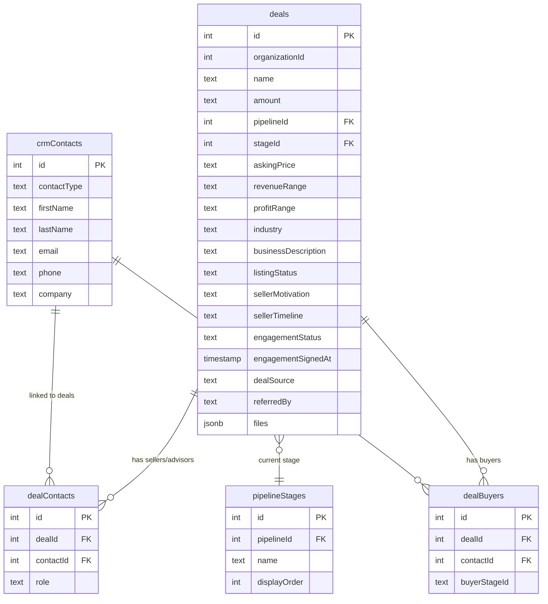

# Deal-Centric Restructuring — Deals as Primary Entity

## Overview

Restructure BrokerVault so **deals are the primary entity** that moves through the pipeline, not sellers. A seller is just a contact associated with a deal (same as how buyers are contacts underneath organizations). This means:

1. Move seller-specific business/financial fields from `crmContacts` to the `deals` table
2. Simplify the seller contact to just a person with contact info
3. Create a public **"Sell Your Business"** intake form using the generic FormBuilder that populates both a deal and a seller contact
4. Update the seller detail page to be a simpler contact view
5. Update the deal detail page to show the business/financial fields that moved from seller

## Problem Statement

Currently, seller-specific business data (revenue, profit, asking price, industry, motivation, timeline, engagement status, listing status, etc.) lives on the `crmContacts` table. This treats the seller *person* as the entity that progresses through pipeline stages. In reality:

- The **deal** (a business being sold) is what progresses through stages
- The **seller** is just the person selling that business — a contact with a role on the deal
- A seller could have multiple deals (selling multiple businesses)
- Business financials (revenue, profit, asking price) describe the deal, not the person

This mirrors the existing buyer model: buyers are contacts linked to deals via `dealBuyers`, with pipeline stages on the deal side.

## Proposed Solution

### Phase 1: Schema — Add Deal Business Fields

Add the following columns to the `deals` table in `shared/schema.ts`:

```typescript
// Business details (moved from seller contact)
askingPrice: text("asking_price"),
revenueRange: text("revenue_range"),      // under_500k, 500k_1m, 1m_5m, etc.
profitRange: text("profit_range"),        // under_100k, 100k_250k, etc.
industry: text("industry"),
businessDescription: text("business_description"),
listingStatus: text("listing_status"),    // not_listed, preparing, active, under_loi, closed

// Seller engagement context (on the deal, not the person)
sellerMotivation: text("seller_motivation"),         // retirement, burnout, partner_dispute, etc.
sellerTimeline: text("seller_timeline"),             // immediate, 3_months, 6_months, etc.
engagementStatus: text("engagement_status"),         // prospect, contacted, meeting_scheduled, etc.
engagementSignedAt: timestamp("engagement_signed_at"),

// Source tracking
dealSource: text("deal_source"),          // referral, direct_marketing, inbound, cold_outreach, intake_form, other
referredBy: text("referred_by"),

// File uploads (financials, tax returns, etc.)
files: jsonb("files"),                    // Array of { name, path, uploadedAt, type }
```

**Files changed:** `shared/schema.ts`

### Phase 2: Schema — Strip Seller Fields from crmContacts

Remove these columns from `crmContacts`:

- `sellerStage` (stages are on deals via pipelineStages)
- `sellerMotivation` (moved to deals)
- `sellerTimeline` (moved to deals)
- `sellerEngagementStatus` (moved to deals)
- `sellerEngagementSignedAt` (moved to deals)
- `sellerAskingPrice` (moved to deals)
- `sellerListingStatus` (moved to deals)
- `sellerSource` (moved to deals)
- `sellerReferredBy` (moved to deals)
- `sellerNotes` (use crmNotes on the deal instead)
- `sellerRevenueRange` (moved to deals)
- `sellerProfitRange` (moved to deals)
- `sellerIndustry` (moved to deals)
- `sellerBusinessDescription` (moved to deals)
- `sellerFiles` (moved to deals)

The seller contact retains only general contact fields: name, email, phone, company, contactType, photo, linkedin, title, etc.

**Files changed:** `shared/schema.ts`

### Phase 3: Backend — "Sell Your Business" Intake Form

Create a new public intake form system using the existing `buyerSurveys` infrastructure pattern but for seller/deal intake.

#### New file: `server/routes/seller-intake-routes.ts`

**Endpoints:**

1. **`GET /api/seller-intake/:organizationSlug`** (public, no auth)
   - Returns the seller intake form configuration for an organization
   - Looks up the org by a public slug or ID
   - Returns survey questions for the intake form
   - If no custom form exists, returns the default seller intake questions

2. **`POST /api/seller-intake/:organizationSlug`** (public, no auth)
   - Submits the seller intake form
   - Creates a new `crmContact` with `contactType: 'seller'` (name, email, phone, company)
   - Creates a new `deal` with business fields populated from the form (asking price, revenue, industry, motivation, timeline, etc.)
   - Links the seller contact to the deal via `dealContacts` with `role: 'primary'`
   - Sets the deal's pipeline to the org's default pipeline, first stage
   - Returns a confirmation

3. **`GET /api/settings/seller-intake-form`** (auth required)
   - Returns the broker's configured seller intake form template
   - If none exists, returns the default template

4. **`PUT /api/settings/seller-intake-form`** (auth required)
   - Saves/updates the seller intake form configuration
   - Uses the generic FormBuilder question format

**Default seller intake form questions:**

| Section | Question | Type | CRM/Deal Field Mapping |
|---------|----------|------|----------------------|
| About You | Full Name | text | contact.firstName + contact.lastName |
| About You | Email | text | contact.email |
| About You | Phone | text | contact.phone |
| About You | LinkedIn Profile | text | contact.linkedinUrl |
| About Your Business | Business Name | text | deal.name |
| About Your Business | Industry | select | deal.industry |
| About Your Business | Business Description | textarea | deal.businessDescription |
| About Your Business | Annual Revenue Range | select | deal.revenueRange |
| About Your Business | Annual Profit/EBITDA Range | select | deal.profitRange |
| About Your Business | Asking Price (if known) | text | deal.askingPrice |
| Selling Context | Reason for Selling | select | deal.sellerMotivation |
| Selling Context | Desired Timeline | select | deal.sellerTimeline |
| Selling Context | How did you hear about us? | select | deal.dealSource |
| Selling Context | Referred by | text | deal.referredBy |

**Files changed:** `server/routes/seller-intake-routes.ts` (new), `server/routes.ts` (register)

### Phase 4: Frontend — Public "Sell Your Business" Page

#### New file: `client/src/pages/seller-intake-page.tsx`

Public page (no auth), accessed via `/sell/:organizationSlug`.

Reuses the existing `FormRenderer` component (same pattern as `/buyer-form/:token`).

**Layout:**
1. Header with broker branding / org name
2. "Interested in selling your business?" intro text
3. Dynamic form rendered from intake form questions
4. Submit button → `POST /api/seller-intake/:organizationSlug`
5. Success state: "Thank you! A broker will be in touch."

**Files changed:** `client/src/pages/seller-intake-page.tsx` (new), `client/src/App.tsx` (add public route)

### Phase 5: Frontend — Seller Intake Form Settings Page

#### New file: `client/src/pages/settings/seller-intake-page.tsx`

Settings page for brokers to customize their seller intake form using the generic `FormBuilder`.

**Layout:**
- Header: "Seller Intake Form"
- Description: "Customize the form that potential sellers see when they visit your intake page"
- Copy-paste public URL: `/sell/:organizationSlug`
- FormBuilder component with sections: "About You", "About Your Business", "Selling Context"
- CRM field mapping options for deal fields + contact fields
- Save button

**Files changed:** `client/src/pages/settings/seller-intake-page.tsx` (new), `client/src/App.tsx` (add settings route), `client/src/components/layout/settings-layout.tsx` (add nav item)

### Phase 6: Frontend — Update Deal Detail Page

Move the business/financial display from the seller detail page to the deal detail page.

Add to the deal detail page sidebar or a new tab:

- **Business Details card**: Industry, Business Description, Revenue Range, Profit Range, Asking Price, Listing Status
- **Seller Context card**: Motivation, Timeline, Engagement Status, Engagement Signed At, Deal Source, Referred By
- **Files section**: Upload/download financial documents on the deal

These fields should use `InlineEdit` components for inline editing, matching the existing deal detail page patterns.

**Files changed:** `client/src/pages/crm/deal-detail-page.tsx`

### Phase 7: Frontend — Simplify Seller Detail Page

Strip the business/financial sections from the seller detail page. The seller contact page should show:

- Contact info header (name, email, phone, photo, company, title, linkedin)
- Linked deals list (fetched from `dealContacts` where contactId = this seller)
- Activity feed
- Tasks
- Notes
- Files (personal contact files, not deal files)

Remove: Stage progression, motivation, timeline, engagement status, asking price, listing status, revenue/profit ranges, industry, business description sections.

**Files changed:** `client/src/pages/crm/seller-detail-page.tsx`

### Phase 8: Backend — Update CRM Routes for Deal Fields

Update the deal CRUD endpoints in `server/routes/crm-routes.ts` to support the new deal fields:

- `POST /api/crm/deals` — accept new business fields on creation
- `PATCH /api/crm/deals/:id` — allow updating new business fields
- `GET /api/crm/deals/:id` — return new business fields in response

Update the `insertDealSchema` in `shared/schema.ts` to include the new columns.

**Files changed:** `server/routes/crm-routes.ts`, `shared/schema.ts`

### Phase 9: Sellers Page — Update Kanban/Table

Update `client/src/pages/crm/sellers-page.tsx`:

- Remove the kanban view (stages are now on deals, not sellers)
- Keep as a simple table/list of seller contacts
- Columns: Name, Email, Phone, Company, Linked Deals count, Created Date
- "View" links to seller detail page
- Keep the "Add Seller" dialog but simplify it (just contact fields, no business fields)

**Files changed:** `client/src/pages/crm/sellers-page.tsx`

## Technical Considerations

### Database Migration Strategy

- Use additive-only migration: add new columns to `deals` first
- Then strip columns from `crmContacts` in the schema definition
- Run `npx drizzle-kit push` to apply (or generate SQL with `drizzle-kit generate`)
- No data migration needed — existing seller data on contacts was test/demo data

### Existing Pattern Reuse

- **FormBuilder/FormRenderer**: Already generic. Use the same `FormQuestion` interface with `crmField` bindings, just mapped to deal fields instead of contact fields
- **Public form pattern**: Follow the same pattern as `/buyer-form/:token` — public page, no auth, token or slug-based access
- **Route extraction**: Follow the established pattern of separate route files in `server/routes/`
- **Inline editing**: Reuse `InlineEdit`, `InlineEditCurrency`, `InlineEditDate` from deal detail page

### Existing Learnings Applied

- **Variable scoping**: Per `docs/solutions/logic-errors/orgid-scope-refactoring-error.md`, declare shared variables at function scope when extracting routes
- **Route files use `db` directly**: Consistent with all other extracted route files, NOT through `storage.ts`

## Acceptance Criteria

- [x] `deals` table has all business/financial fields (asking price, revenue, profit, industry, description, listing status, motivation, timeline, engagement status, source, referredBy, files)
- [x] `crmContacts` no longer has seller-specific fields (sellerStage, sellerMotivation, sellerTimeline, sellerEngagementStatus, sellerAskingPrice, sellerListingStatus, sellerSource, sellerReferredBy, sellerNotes, sellerRevenueRange, sellerProfitRange, sellerIndustry, sellerBusinessDescription, sellerFiles, sellerEngagementSignedAt)
- [x] Public "Sell Your Business" form at `/sell/:organizationSlug` works without authentication
- [x] Form submission creates both a seller contact AND a deal, linked via `dealContacts`
- [x] Deal detail page shows business details, seller context, and files
- [x] Seller detail page is simplified to contact info + linked deals
- [x] Sellers page no longer has kanban view (stages are on deals)
- [x] Broker can customize the seller intake form via settings
- [x] Settings nav includes "Seller Intake Form" link
- [x] `insertDealSchema` updated with new fields
- [x] Deal CRUD endpoints accept/return new fields

## Files Summary

| File | Action |
|------|--------|
| `shared/schema.ts` | Add deal business fields, strip seller fields from crmContacts, update insertDealSchema |
| `server/routes/seller-intake-routes.ts` | **New** — Public intake form + settings endpoints |
| `server/routes.ts` | Register seller intake routes |
| `server/routes/crm-routes.ts` | Update deal CRUD for new fields |
| `client/src/pages/seller-intake-page.tsx` | **New** — Public "Sell Your Business" form page |
| `client/src/pages/settings/seller-intake-page.tsx` | **New** — Seller intake form builder settings |
| `client/src/pages/crm/deal-detail-page.tsx` | Add business details, seller context, files sections |
| `client/src/pages/crm/seller-detail-page.tsx` | Simplify to contact-only view with linked deals |
| `client/src/pages/crm/sellers-page.tsx` | Remove kanban, simplify to table view |
| `client/src/App.tsx` | Add `/sell/:organizationSlug` (public) and `/settings/seller-intake` routes |
| `client/src/components/layout/settings-layout.tsx` | Add "Seller Intake Form" to settings nav |

## ERD — Deal-Centric Model



## Sources & References

- Similar implementation: `client/src/pages/buyer-form-page.tsx` — public form pattern to replicate
- Form system: `client/src/components/form-builder.tsx`, `client/src/components/form-renderer.tsx`
- Buyer survey routes: `server/routes/buyer-survey-routes.ts` — pattern for public form endpoints
- Existing deal schema: `shared/schema.ts:2684-2728`
- Existing seller fields: `shared/schema.ts:2618-2637`
- Bug fix reference: `docs/solutions/logic-errors/orgid-scope-refactoring-error.md`
- Buyer Management Hub plan: `docs/plans/2026-02-21-feat-buyer-management-hub-plan.md`
